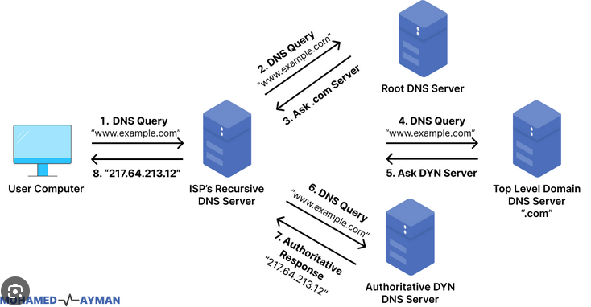

# Internet Basics
Internet: global system of interconnected computer networks that utilize the Internet Protocol Suite (TCP/IP) to communicate between devices.

## DNS
The Domain Name System is the phonebook of the internet. It translates domain names to IP addresses.

There are 4 DNS servers involved in loading a webpage:
- **DNS recursor (Or resolver server)**: Can be thought of as a librarian who is asked to go find a particular book somewhere in a library. It's designed to receive queries from client machines through applications such as web browsers. Then it's responsible for making additional requests in order to satisfy the client's query. It's provided by the ISP for home networks.
- **Root nameserver**: First step in translating human readable host names into IP addresses. It can be thought of like an index in a library that points to different racks of books.
- **TLD nameservers**: Top Level Domain server can be thought of a specific rack of books in a library. It hosts the last portion of a hostname (in example.com, the TLD server is "com").
- **Authoritative nameserver**: Final nameserver can be thought of as a dictionary on a rack of books, in which a specific name can be translate into its definition. If the name server has access to the requested record, it will return the IP address for the requested hostname back to the DNS recursor that made the initial request.

Process:
1. User types domain name in browser
2. Browser checks its own cache and OS-level cache for IP address of domain
3. If it can't find it, the browser queries the resolver server (ISP)
4. The resolver server checks its own internal caches
5. If it can't find it, the resolver server queries the root nameserver
6. The root nameserver responds with the TLD nameserver
7. The resolver then queries the TLD nameserver
8. The TLD nameserver responds with the authoritative nameserver
9. The resolver queries the authoritative nameserver, who returns the IP addresses for the query

Types of Queries:
- **Recursive query**: DNS client requires that a DNS server (usually the resolver) will respond to the client with either the requested resource record or an error msg. (Client -> Resolver)
- **Iterative query**: DNS client will allow a DNS server to return the best answer it can. If the queried server does not have a match, it will return a referral to a DNS server that is closer to the requested resource. This process continues until either an error or timeout occurs. (Resolver -> Root)
- **Non-recursive query**: This will occur when a DNS resolver client queries a DNS server for a record that it has access to either because it's authoritative for the record or the record exists inside its cache. Typically, a DNS server will cache DNS records to prevent additional network traffic on upstream servers. (Resolver -> Authoritative)

## HTTP/HTTPS
Hypertext Transfer Protocol. Backbone of internet communication. HTTPS encrypts the data that is being transferred. 

Request types:
- **GET**: Requests data from a specified resource
- **POST**: Submits data to be processed to a specified resource
- **PUT**: Uploads a representation of the specified resource
- **DELETE**: Deletes the specified resource

Headers:
- **Request headers**: Contains info about the request, like the type of browser making the request, the type of document being requested, and the type of data being sent.
- **Response headers**: Contains info about the response, like the server type, date and time of the response, and the type of data being returned.

## SSL
Secure Sockets Layer. Standard security technology for establishing an encrypted link between a web server and a browser. This link ensures that all data passed between the web server and browsers remain private and integral. This is what HTTPS uses (and TLS). Uses public key encryption.

SSL certificates are used to authenticate servers. They contain the server's public key, the server's identity, and the digital signature of the certificate-issuing authority so that clients can verify that the server is who it claims to be.

## TLS
Transport Layer Security. Successor to SSL. Provides secure communication between web browsers and servers. 

TLS Handshake:
1. Client sends a "Client Hello" message to the server, Includes info about the OS, browser, and supported ciphers.
2. Server responds with a "Server Hello" message, Includes server info, the chosen cipher and the server's SSL certificate (including domain name, and public key used for encryption).
3. Client verifies the certificate. If it's valid, it generates a random session key and encrypts it with the server's public key. It sends the encrypted key to the server.
4. The server decrypts the session key using its private key and sends an encrypted "Finished" message to the client.
5. The client decrypts the message and sends an encrypted "Finished" message to the server, this includes a previous message digest to ensure no middle-man attack.

## TCP/IP
Transmission Control Protocol, communication standard (transport layer) that allows devices to exchange data over a network. It breaks data into packets, ensures data integrity and guarantees that packets will be delivered in the order they were sent. It has ways to detect and correct data loss, and implements congestion control.

High level overview: 
- Client and server establish a connection using a 3-way handshake.
- They explicitly acknowledge each other's presence, and agree on when close their connection using specific header bits.
- Good for reliable data transmission, but can be slow.

## UDP
User Datagram Protocol: Communications protocol for time-sensitive applications like DNS lookups, gaming, etc... Sends packets directly to a target computer without establishing a connection first. It's faster than TCP, but less reliable. It doesn't guarantee delivery of packets, and doesn't guarantee the order of packets.

It's suitable for applications that can tolerate some data loss. 