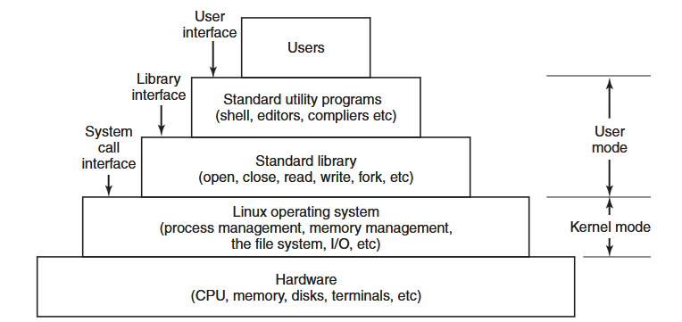
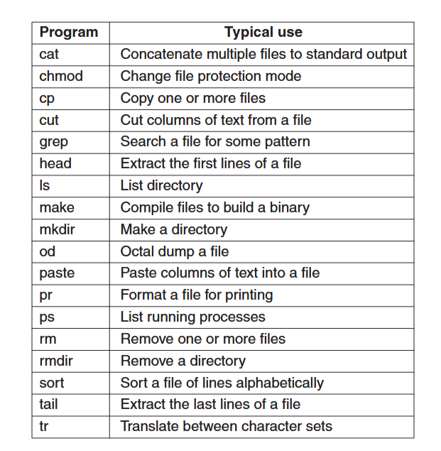
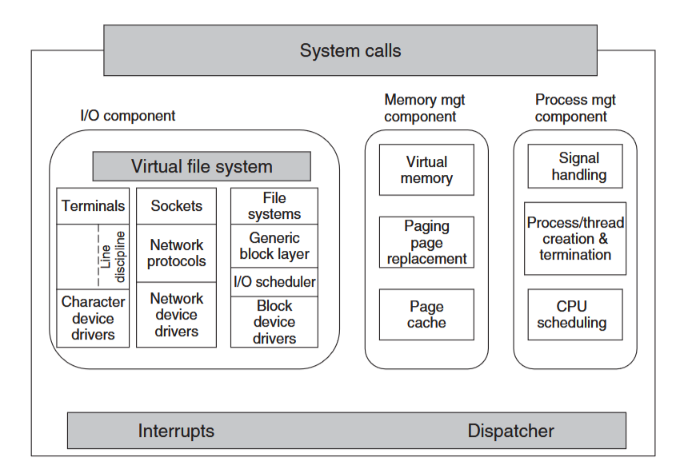
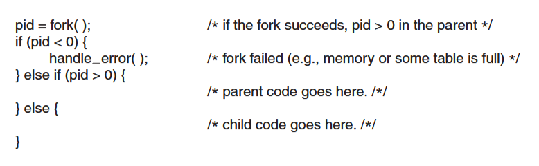
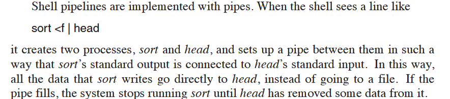
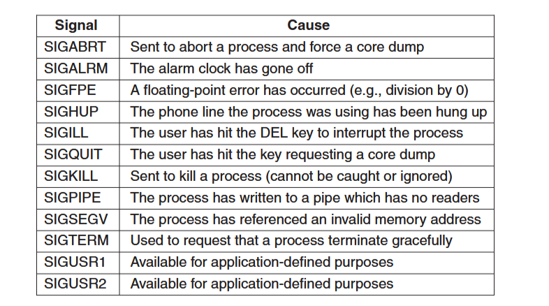
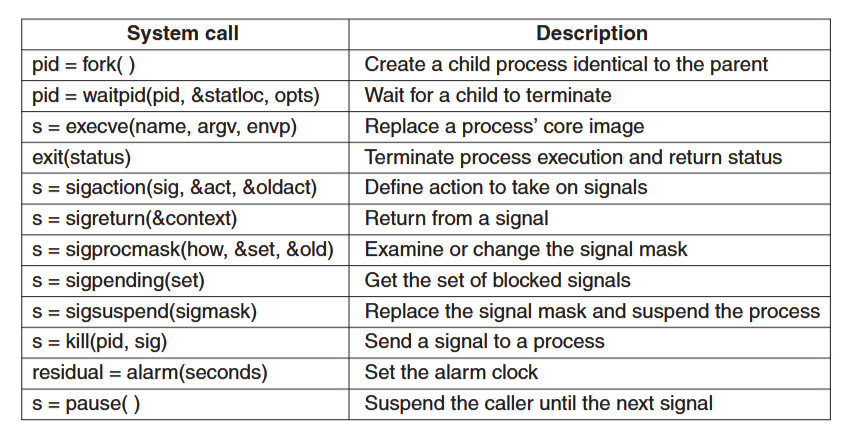
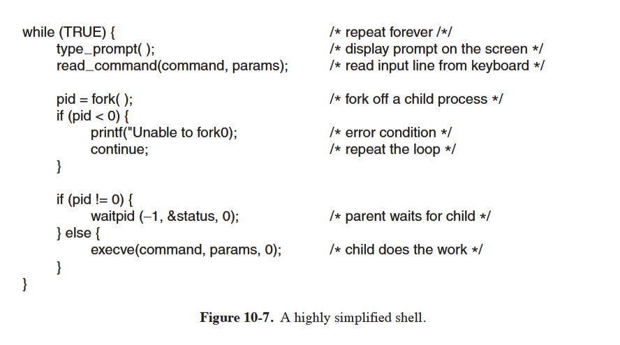
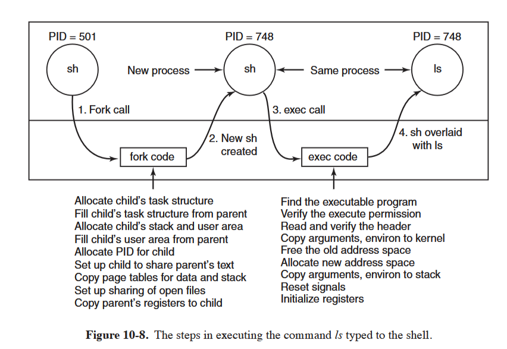

# Modern Operating Systems
Notes from Andrew S. Tanenbaum's book "Modern Operating Systems", specifically, Chapter 10 case study of Linux.

## Interfaces to Linux

Programs make system calls by putting the arguments in registers, or sometimes on the stack, and issuing trap instructions to switch from user mode to kernel mode. Since there is no way to write a trap instruction in C, a library is provided, with one procedure per system call. These are written in assembly, but can be called from C.

There are technically 3 kinds of interfaces to Linux: the true system call interface, the library interface, and the interface formed by the set of standard utility programs.

## Bash Shell
Commands may take args, which are passed to the called program as character string. For example:
`cp src dest`
invokes the cp program with 2 args: src and dest. The way the program handles these args is up to the program.

Arguments that control the operation of a command or specify an optional value are called flags, and by convention are indicated with a dash. 

Wildcards: `*` matches any string of characters, `?` matches any single character, `[...]` matches any one of the characters inside the brackets.
For example: `ls [ape]*` lists all files that start with a, p, or e.

A program like he shell doesn't have to open the terminal (keyboard and monitor) in order to read from it or write to it. Instead, when it starts up, it automatically has access to a file called standard input, a file called standard output, and a file called standard error. 

Redirecting stdin and stdout: `prog < file1 > file2` runs prog with stdin coming from file1 and stdout going to file2.

Running a process in the background: follow command with &. For example: `prog &` runs prog in the background.

## Linux Utility Programs
Roughly speaking, linux consists or standard utility programs that can be divided into 6 categories:
- File and directory manipulation commands
- Filters
- Program development tools, such as editors and compilers
- Text processing
- System administration
- Miscellaneous

## Kernel Structure

The kernel sits directly on the hardware and enables interactions with I/O devices and the memory management unit (MMU) and controls CPU access to them. At the lowest level, it contains interrupt handlers, which are the primary way for interacting with devices, and the low-level dispatching mechanism. This dispatching occurs when an interrupt happens. It stops the running process, saves its state in the kernel process structures, and starts the appropriate driver. Process dispatching also happens when the kernel compeltes some operations and it's time to start up a user process again. 

I/O Component: contains all kernel pieces responsible for interacting with devices and performing network and storage I/O operations. All I/O operations are integrated under a Virtual File System (VFS) layer. So at the top level, performing a read operation on a file, whether it's in memory or on disk, is the same as performing a read operation to retrieve a chracter from a terminal input.

All Linux drivers are classified as either character-device drivers or block-device drivers. Seeks and random accesses are allowed on block devices only.

Memory Management Component: tasks include maintaining the virtual to physical memory mappings, maintaining a cache of recently accessedd pages and implementing a good page-replacement policy. 

Process Management Component: creates and destroys processes. It also includes the process scheduler, which chooses which process (or rather thread) to run next. Code for signal handling also belongs here.

Linux also supports dynamically loadable modules. These can be used to add or replace the default device drivers, file system, networking, or other kernel codes. 

The system call interface is where all system calls go, causing a trap which switches the execution from user mode into protected kernel mode and passes control to one of the kernel components described above. 

## Processes in Linux
### Fundamentals
Each process runs a single program and initially has a single thread of control (one program counter which keeps track of the next instruction to be executed). Linux allows a process to create additional threads once it starts.

Daemons: Background processes. These are started by a shell script when the system is booted. Cron is the most popular kind of daemon. It wakes up once a minute to check if there is any work for it to do. This is needed because Linux might want to schedule activities in the future. It's also used to start up periodic activities, like backups. Other daemons handle incoming and outgoing mail, manage printer queues, check if there are enough free pages in memory, etc.

Processes are created in a simple manner: the fork system call creates an exact copy of the original process. The parent and child each have their own, private memory images. Open files are shared between parent and child: if a parent has a file open, the child also has it open. Changes made by either one will be visible to both (obviously, since that's also the case with all other unrelated processes).

Processes are named by their PIDs. Fork returns 0 to the child and the PID of the child to the parent. The child can find out its own PID by calling getpid. 

Processes in Linux can communicate with each other using a form of message passing. These channels are called pipes. 

Processes can also communicate in another way: software interrupts. A process can send a signal to another process. Processes can tell the system what they want to happen when an incoming signal arrives. They can ignore it, catch it, or let the signal kill the process. 

A process can only send signals to members of its process group, which consists of its parent (and other ancestors), siblings, and children. 

### Process Management System Calls
To wait for a child to finish, the parent executes a waitpid system call, which has 3 parameters:
- First one allows the caller to wait for a specific child.
- Second one is the address of a variable that will be set to the child's exit status.
- Third one determines whether the caller blocks or returns if no child is already terminated.

The shell needs the child process to execute the command typed by the user. It does this by using the exec system call, which causes its entire core images to be replaced by the file named in its first parameter. In general, exec has 3 params:
- The name of the file to be executed (program name)
- A pointer to the argument array (list of string arguments)
- A pointer to the environment array (* to array of strings containing assignments of the form of name = val used to pass info such as terminal type and home dir name to the new program)
Other library procedures are provided to allow parameters to be omitted or specified in various ways (execve, execv, etc..)
All of these procedures invoke the same underlying system call.

sigaction: processes can use this system call to catch a signal. 
alarm: system call that causes a signal to be sent to the caller after a specified number of seconds.
pause: do nothing until a signal arrives.

### Implementation of Processes and Threads
Processes run in user mode, but when they make a system call, they switch to kernel mode. This is all done in the same thread. 

The kernel internally represents processes as tasks, via the structure task_struct. A single-threaded process will be represented with one task structure and a multithreaded process will have one task structure for each thread.

For each process, a process descriptor of type task_struct is resident in memory at all times. It contains info needed for the kernel's management of all processes such as scheduling parameters, lists of open-file descriptors, and so on. 

Upon creation, a process descriptor along with memory for the kernel-mode stack is allocated. 

The kernel organizes all processes in a doubly linked list of task_struct's.

The information in the process descriptor is described as follows:
- Scheduling params: process priority, amount of CPU time consumed recently, amount of time spent sleeping recently
- Memory image: pointers to the text, data, and stack segments (or page tables). If the text segment is shared, the next ptr points to the shared text table. 
- Signals: Masks showing which signals are being ignored, which are being caught, which are being blocked temporarily, and which are in the process of being delivered.
- Machine registers: when a trap to the kernel occurs, the machine registers are saved here
- System call state: info about the current system call, including params and results
- File descriptor table: a file descriptor is used as an index into this table to locate the in-core data sctructure corresponding to the file (if file I/O is involved in the process)
- Accounting: ptr to a table that keeps track of the user and system CPU time used by the process. 
- Kernel stack: fixed stack for use by the kernel part of the process
- Miscellaneous: current process state, event being waited for, time until alarm clock goes off, PID, PID of the parent process, and user/group identification

So creating a process is pretty straightforward:
- A new process descriptor and user area are created for the child process and filled in largely from the parent
- The child is given a PID
- Its memory map is set up
- Its given shared access to its parents files
- Its registers are set up and it's ready to run

After the child process starts running:
- exec system call is ran giving the command name as a parameter
- Kernel finds and verifies the executable, copies the arguments and environment strings to the kernel, and releases the parent's address space and its page tables.
- Now the new address must be created and filled in: new page tables are set up to indicate that no pages are in memory. When the new process starts running, it will immediately get a page fault, which will causes the first page of code to be paged in from the executable. In this way, nothing has to be loaded in advance, so programs can start quickly and fault in the pages that they need, no more no less (demand paging).
- Arguments and environment strings are copied to the new stack, signals are reset, and the registers are initialized to 0. 
- Now, the command can start running.

### Threads
