# Modern Operating Systems
Notes from Andrew S. Tanenbaum's book "Modern Operating Systems", specifically, Chapter 10 case study of Linux.

## Interfaces to Linux
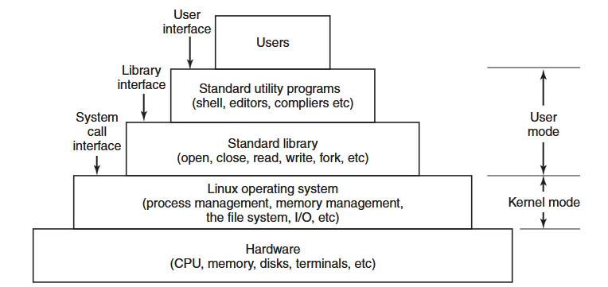

Programs make system calls by putting the arguments in registers, or sometimes on the stack, and issuing trap instructions to switch from user mode to kernel mode. Since there is no way to write a trap instruction in C, a library is provided, with one procedure per system call. These are written in assembly, but can be called from C.

There are technically 3 kinds of interfaces to Linux: the true system call interface, the library interface, and the interface formed by the set of standard utility programs.

## Bash Shell
Commands may take args, which are passed to the called program as character string. For example:
`cp src dest`
invokes the cp program with 2 args: src and dest. The way the program handles these args is up to the program.

Arguments that control the operation of a command or specify an optional value are called flags, and by convention are indicated with a dash. 

Wildcards: `*` matches any string of characters, `?` matches any single character, `[...]` matches any one of the characters inside the brackets.
For example: `ls [ape]*` lists all files that start with a, p, or e.

A program like he shell doesn't have to open the terminal (keyboard and monitor) in order to read from it or write to it. Instead, when it starts up, it automatically has access to a file called standard input, a file called standard output, and a file called standard error. 

Redirecting stdin and stdout: `prog < file1 > file2` runs prog with stdin coming from file1 and stdout going to file2.

Running a process in the background: follow command with &. For example: `prog &` runs prog in the background.

## Linux Utility Programs
Roughly speaking, linux consists or standard utility programs that can be divided into 6 categories:
- File and directory manipulation commands
- Filters
- Program development tools, such as editors and compilers
- Text processing
- System administration
- Miscellaneous

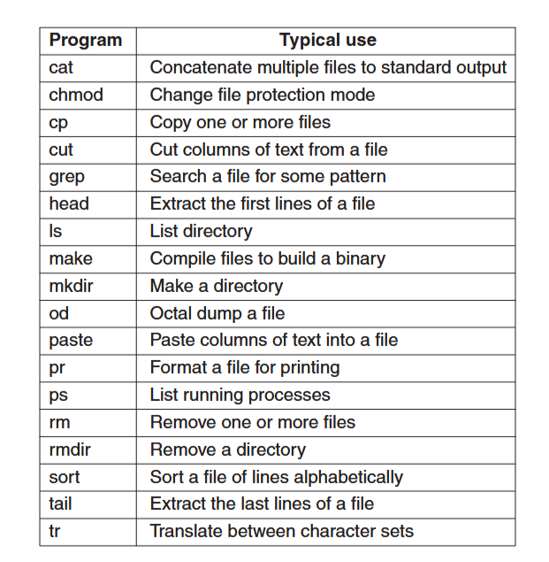

## Kernel Structure
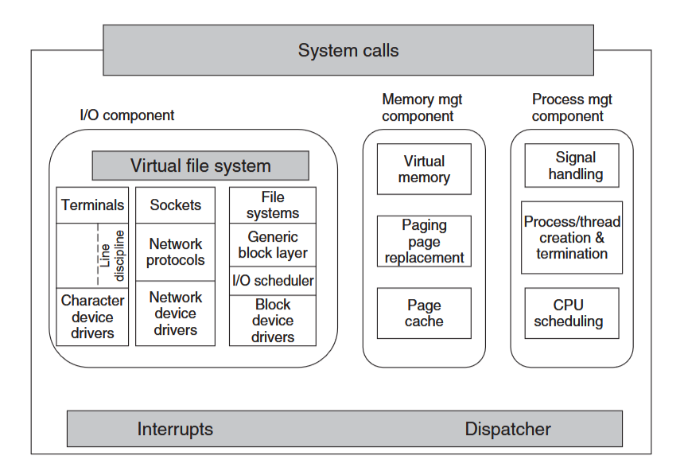

The kernel sits directly on the hardware and enables interactions with I/O devices and the memory management unit (MMU) and controls CPU access to them. At the lowest level, it contains interrupt handlers, which are the primary way for interacting with devices, and the low-level dispatching mechanism. This dispatching occurs when an interrupt happens. It stops the running process, saves its state in the kernel process structures, and starts the appropriate driver. Process dispatching also happens when the kernel compeltes some operations and it's time to start up a user process again. 

I/O Component: contains all kernel pieces responsible for interacting with devices and performing network and storage I/O operations. All I/O operations are integrated under a Virtual File System (VFS) layer. So at the top level, performing a read operation on a file, whether it's in memory or on disk, is the same as performing a read operation to retrieve a chracter from a terminal input.

All Linux drivers are classified as either character-device drivers or block-device drivers. Seeks and random accesses are allowed on block devices only.

Memory Management Component: tasks include maintaining the virtual to physical memory mappings, maintaining a cache of recently accessedd pages and implementing a good page-replacement policy. 

Process Management Component: creates and destroys processes. It also includes the process scheduler, which chooses which process (or rather thread) to run next. Code for signal handling also belongs here.

Linux also supports dynamically loadable modules. These can be used to add or replace the default device drivers, file system, networking, or other kernel codes. 

The system call interface is where all system calls go, causing a trap which switches the execution from user mode into protected kernel mode and passes control to one of the kernel components described above. 

## Processes in Linux
### Fundamentals
Each process runs a single program and initially has a single thread of control (one program counter which keeps track of the next instruction to be executed). Linux allows a process to create additional threads once it starts.

Daemons: Background processes. These are started by a shell script when the system is booted. Cron is the most popular kind of daemon. It wakes up once a minute to check if there is any work for it to do. This is needed because Linux might want to schedule activities in the future. It's also used to start up periodic activities, like backups. Other daemons handle incoming and outgoing mail, manage printer queues, check if there are enough free pages in memory, etc.

Processes are created in a simple manner: the fork system call creates an exact copy of the original process. The parent and child each have their own, private memory images. Open files are shared between parent and child: if a parent has a file open, the child also has it open. Changes made by either one will be visible to both (obviously, since that's also the case with all other unrelated processes).

Processes are named by their PIDs. Fork returns 0 to the child and the PID of the child to the parent. The child can find out its own PID by calling getpid. 
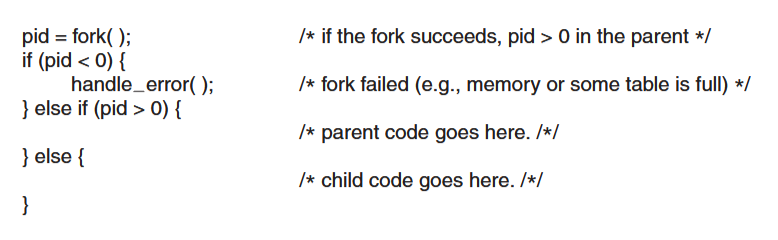

Processes in Linux can communicate with each other using a form of message passing. These channels are called pipes. 
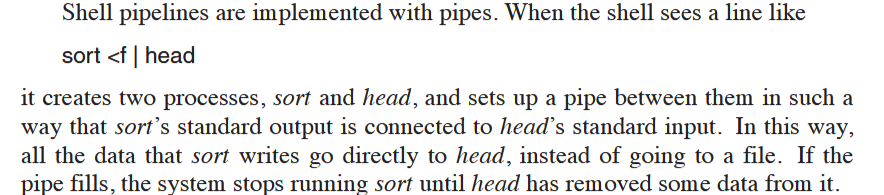

Processes can also communicate in another way: software interrupts. A process can send a signal to another process. Processes can tell the system what they want to happen when an incoming signal arrives. They can ignore it, catch it, or let the signal kill the process. 

A process can only send signals to members of its process group, which consists of its parent (and other ancestors), siblings, and children. 
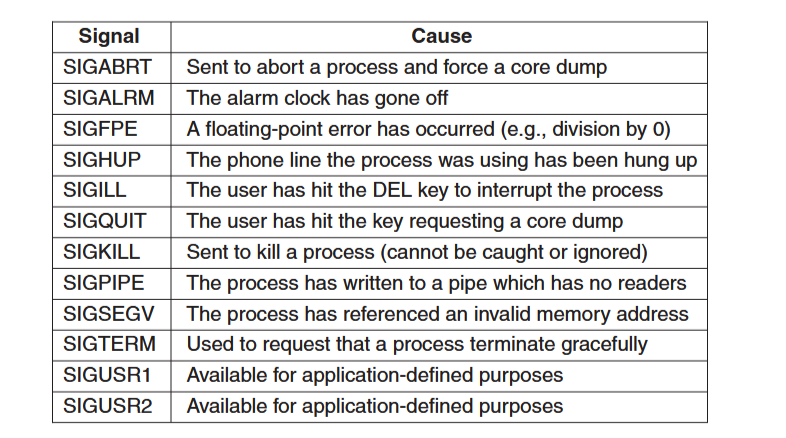

### Process Management System Calls
To wait for a child to finish, the parent executes a waitpid system call, which has 3 parameters:
- First one allows the caller to wait for a specific child.
- Second one is the address of a variable that will be set to the child's exit status.
- Third one determines whether the caller blocks or returns if no child is already terminated.

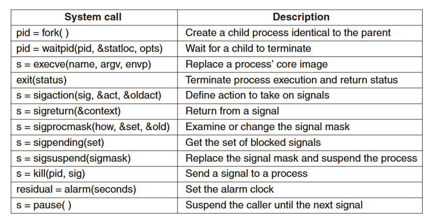

The shell needs the child process to execute the command typed by the user. It does this by using the exec system call, which causes its entire core images to be replaced by the file named in its first parameter. In general, exec has 3 params:
- The name of the file to be executed (program name)
- A pointer to the argument array (list of string arguments)
- A pointer to the environment array (* to array of strings containing assignments of the form of name = val used to pass info such as terminal type and home dir name to the new program)
Other library procedures are provided to allow parameters to be omitted or specified in various ways (execve, execv, etc..)
All of these procedures invoke the same underlying system call.

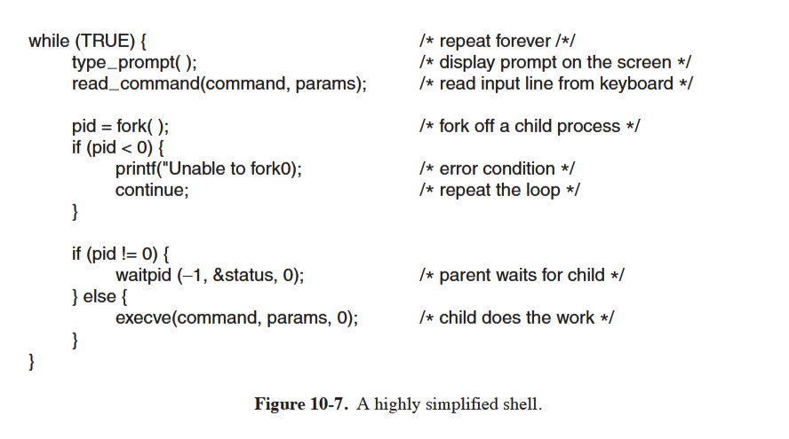

sigaction: processes can use this system call to catch a signal. 
alarm: system call that causes a signal to be sent to the caller after a specified number of seconds.
pause: do nothing until a signal arrives.

### Implementation of Processes and Threads
Processes run in user mode, but when they make a system call, they switch to kernel mode. This is all done in the same thread. 

The kernel internally represents processes as tasks, via the structure task_struct. A single-threaded process will be represented with one task structure and a multithreaded process will have one task structure for each thread.

For each process, a process descriptor of type task_struct is resident in memory at all times. It contains info needed for the kernel's management of all processes such as scheduling parameters, lists of open-file descriptors, and so on. 

Upon creation, a process descriptor along with memory for the kernel-mode stack is allocated. 

The kernel organizes all processes in a doubly linked list of task_struct's.

The information in the process descriptor is described as follows:
- Scheduling params: process priority, amount of CPU time consumed recently, amount of time spent sleeping recently
- Memory image: pointers to the text, data, and stack segments (or page tables). If the text segment is shared, the next ptr points to the shared text table. 
- Signals: Masks showing which signals are being ignored, which are being caught, which are being blocked temporarily, and which are in the process of being delivered.
- Machine registers: when a trap to the kernel occurs, the machine registers are saved here
- System call state: info about the current system call, including params and results
- File descriptor table: a file descriptor is used as an index into this table to locate the in-core data sctructure corresponding to the file (if file I/O is involved in the process)
- Accounting: ptr to a table that keeps track of the user and system CPU time used by the process. 
- Kernel stack: fixed stack for use by the kernel part of the process
- Miscellaneous: current process state, event being waited for, time until alarm clock goes off, PID, PID of the parent process, and user/group identification

So creating a process is pretty straightforward:
- A new process descriptor and user area are created for the child process and filled in largely from the parent
- The child is given a PID
- Its memory map is set up
- Its given shared access to its parents files
- Its registers are set up and it's ready to run

After the child process starts running:
- exec system call is ran giving the command name as a parameter
- Kernel finds and verifies the executable, copies the arguments and environment strings to the kernel, and releases the parent's address space and its page tables.
- Now the new address must be created and filled in: new page tables are set up to indicate that no pages are in memory. When the new process starts running, it will immediately get a page fault, which will causes the first page of code to be paged in from the executable. In this way, nothing has to be loaded in advance, so programs can start quickly and fault in the pages that they need, no more no less (demand paging).
- Arguments and environment strings are copied to the new stack, signals are reset, and the registers are initialized to 0. 
- Now, the command can start running.

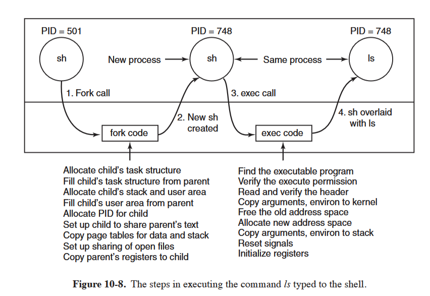

### Threads
The main issue in introducing threads is maintaining the correct traditional UNIX smenatics. 

```pid = clone(function, stack_ptr, sharing_flags, arg);```

The call creates a new thread, either in the current process or in a new process, depending on sharing_flags. If the new thread is in the current process, it shares the address space with the existing threads. If the address space is not shared, then the new thread gets an exact copy of the address space, but subsequent writes by the new thread are not visible to the old ones. In either case, the new thread gets its own private stack, with the stack ptr initialized to stack_ptr. 

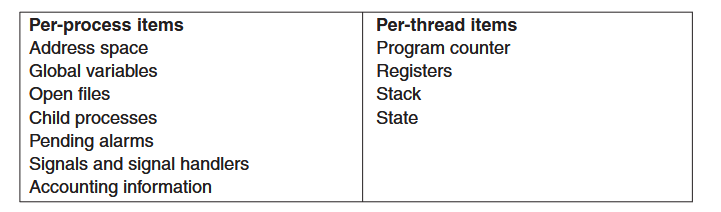

UNIX systems associate a single PID with a process, independent of whether the process has one thread or many. In order to be compatible with other UNIX systems, Linux distinguishes between a PID and a task identifier (TID). Both fields are stored in the task_struct. When clone is used to create a new process that shares nothing with its creator, PID is set to a new value: otherwise, the task receives a new TID, but inherits the PID. This ensures all threads in a process receive the same PID. 

Threads allow multiple executions to take place in the same process environment, to a large degree, independent of one another. Having multiple threads running in parallel in one process is analogous to having multiple processes running in parallel in one computer. In this case, threads share an address space and other resources, while processes share physical memory, disks, printer, and other resources.

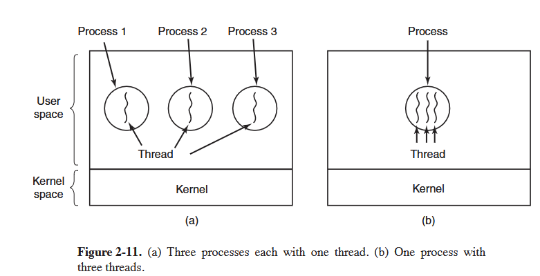


### Scheduling
Linux threads are kernel threads, so scheduling is based on threads, not processes. 

There's 3 classes of threads for scheduling purposes:
- Real-time FIFO
- Reat-time round robin
- Timesharing

Real-time FIFO threads are the highest priority and are not preemtable except by a newly readied real-time FIFO thread with even higher priority. 
Real-time round-robin threads are the same as real-time FIFO threads except that they have multiple quanta (quantum: amount of CPU spends on a thread before switching to another thread) associated with them, and are preemptable by the clock. 

If multiple real-time round-robin threads are ready, each one is run for its quantum, after which it goes to the end of the list of real-time round-robin threads. 

Real-time threads aren't actually real-time, they're just higher priority than timesharing threads. They are internally represented with priority levels from 0 to 99, 0 being the highest priority.

The conventional, non-real-time threads form a separate class and are scheduled by a separate algorithm so they do not compete with the real-time threads. These are associated with priority levels from 100 to 139, 100 being the highest priority. 

Time in Linux: 1 jiffy = 1 tick of the clock, which can be configured to 500, 250, or even 1Hz. 

In order to avoid wasting CPU cycles for servicing the timer interrupt, the kernel can even be configured in tickless mode. This is useful when there is only one process running in the system, or when the CPU is idle and needs to go into power-saving mode. HRTs (high-resolution timers) allow the kernel to keep track of time in sub-jiffy granularity. 

Static priority: Linux associates a nice value with each thread. The default is 0, but this can be changed using the nice(value) system call, where value ranges from -20 to +19. -20 is highest priority. Only sysadmins can set -1 to -20 vals.

Runqueue: key data structure used by the scheduler to track all runnable tasks in the system and select the next one to run. A runqueue is associated with each CPU in the system.

Completely Fair Scheduler (CFS): Main idea is to use a red-black tree as the runqueue data structure. Tasks are ordered in the tree based on the amount of time they spend running on the CPU, called vruntime. 
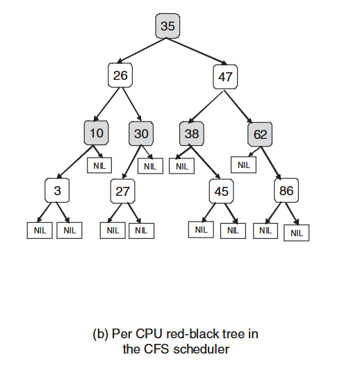

Each internal node in the tree corresponds to a task. Children to the left have had less CPU time, and will be scheduled sooner. 
CFS can be described as follows:
- Schedule the task which has had the least CPU time, typically the leftmost node in the tree.
- Periodically, CFS increments the task's vruntime value based on the time it has already run, and compares this to the current leftmost node in the tree. If the running task still has a smaller vruntime, it will continue to run. Otherwise, it will be inserted at the appropriate place in the tree, and CPU will be given to the leftmost node.
- To account for nice values and priorities, CFS changes the effective rate at which a task's virtual time passes when it's running.

Selecting a node to run can be done in constant time, wheras inserting a task in the runqueue is done in O(logn) time. This is usually acceptable.

*quick note: red-black trees are self-balancing binary search trees. They are used to store sorted data and allow for efficient insertion, deletion, and search operations.

The CFS scheduler performs periodic load balancing across runqueues of different CPUs to ensure that sys load is well balanced. 

A runqueue only consists of tasks that are runnable. For tasks that are waiting on I/O ops or other kernel events, they join waitqueue.
A waitqueue is associated with each event that tasks may wait on. 

### Synchronization
The kernel code contains synchronization variables in numerous locations. A spinlock is an example, which prevents multiple threads from accessing shared resources at the same time. It's a loop that a thread enters when it tries to acquire a lock, and the thread keeps looping until it gets the lock.

At the lowest level, Linux provides wrappers around the hardware-supported atomic instructions, via operations such as atomic_set and atomic_read.

Since modern hardware reorders memory operations, Linux provides memory barriers. Using operations like rmb and wmb guarantees that all read/write memory operations preceding the barrier call have completed before any subsequent accesses take place.

Threads that aren't allowed to block use spinlocks and spin read/write locks. 

Threads that are allowed to block use mutexes and semaphores. 

### Booting Linux
Generally, the following steps represent the boot process:
- BIOS performs Power-On-Self-Test (POST) and initial device discovery and initialization
- Next, the first sector of the boot disk, the master boot record (MBR), is read into fixed memory location and executed. This sector contains a small program that loads a standalone program called boot from the boot device, which copies itself to a fixed high-memory address.
- Boot then reads the root directory of the boot device. It reads the OS kernel and jumps to it. At this point, it's finished its job and the kernel is running
- The kernel start-up code is written in assembly and is highly machine dependent. Usually it sets up the kernel stack, identifies CPU type, calculates amount of RAM present, disables interrupts, enables the MMU, and finally calls the C main procedure to start the main part of the OS
- The C code does some initialization: allocates a message buffer to help debug boot problems, the kernel data structures are allocated.
- At this point, the system begins autoconfiguration. It uses config files telling what kinds of I/O devices might be present, and probes devices to see which ones are actually present.
- Once all hardware is configured, process 0 is crafted: its stack is set up, and its run
- Process 0 continues initialization, doing things like programming the real-time clock, mounting the root file system, and creating init (process 1) and the page daemon (process 2)
- Init checks its flags, and figures out if its a single user or multiuser environment. If single, it forks off a process that executes the shell and waits for this process to exit. If multiuser, it forks a process that executes the system initialization shell script `etc/rc`, then reads `/etc/ttys`, which lists the terminals and some of their properties. For each enabled terminal, it forks off a copy of itself, which does some housekeeping and then executes a program called getty.
- Getty sets the line speed and other peroperties for each line, and then displays login prompt.
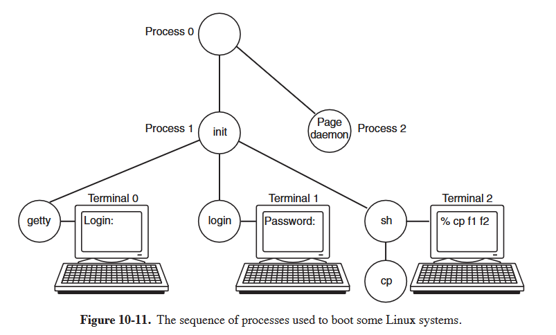

## Memory management
### Fundamentals
Each process has an address space that logically consists of 3 segments: text, data, and stack. 
- Text segment: contains machine instructions that form the program's executable code. It's produced by the compiler and assembler. Normally read-only, so it doesn't shrink or grow.
- Data segment: contains storage for all the program's variables, strings, arrays, and other data. It's divided into initialized data and uninitialized data (BSS block). Initialized part of the data segment contains variables and compiler constants that need and initial value when the program is started. All the BSS variables are initialized to 0. The data segment can change. Programs modify their variables all the time. It can grow and shrink as memory is dynamically allocated. The system call brk allows a program to set the size of its data segment. This is used by malloc. The process address-space descriptor contains info on the range of dynamically allocated memory areas in the process, called the heap.
- Stack segment: Starts at or near the top of the virtual address space and grows down toward 0. If it grows below the bottom of the stack range, stack overflow. 
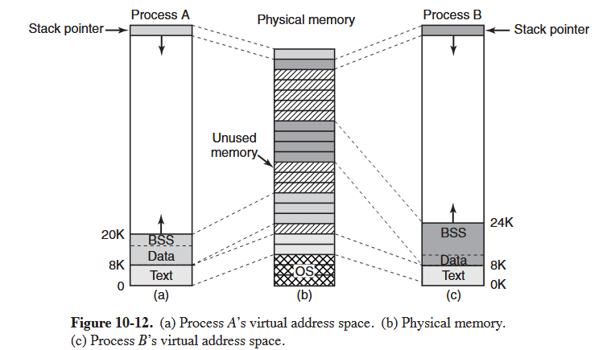

When a program starts, its stack is not empty. It contains all the environment (shell) variables as well as the command line typed to the shell to invoke it. This is how programs can discover their arguments. The stack is used to store temp data like local variables, function parameters, and return addresses used within currently active functions.

Linux supports shared text segments. Mapping is done by the virtual-memory hardware. 

Data and stack segments are never shared except after a fork, and then only those pages that are not modified.

Processes can also access file data through memory-mapped files. This makes it possible to map a file onto a portion of a process's address space so that the file can be manipulated as if it were a byte array in memory. Much faster than read write I/O. 

### Memory Management System Calls
Most Linux systems have system calls for managing memory. 
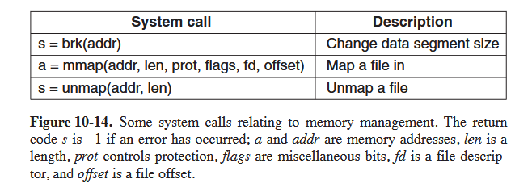

### Memory Management Implementation
Each Linux process on a 32-bit machine gets 3 GB of virtual address space for itself, with the remaining 1 GB reserved for its page tables and other kernel data. That 1 GB isn't visible in user mode, but becomes accessible when the process traps into the kernel.

Technically, on 64-bit machines, each process gets 128 TB of virtual address space.


### Physical Memory Management
In order to allow multiple processes to share the physical memory, Linux monitors the use of the physical memory, allocates more memory as needed by processes, dynamically maps portions of the physical memory into the addr space of different processes.

Not all physical memory can be treated identically, especially with respect to I/O and virtual memory. Linux distinguishes between the following memory zones:
- `ZONE_DMA and ZONE_DMA32`: pages that can be used for DMA (direct memory access)
- `ZONE_NORMAL`: normal, regularly mapped pages
- `ZONE_HIGHMEM`: pages with high-memory addresses, which are not permanently mapped

The layout of the memory zones is architecture dependent. The kernel maintains a zone structure for each of the 3 zones, and can perform memory allocations for the 3 zones separately. 

Main memory in Linux consists of 3 parts: the first 2 parts, the kernel and memory map, are pinned in memory and can't be swapped out. The rest of memory is divided into page frames, each of which can contain a text, data, or stack page, a page-table page, or be on the free list.

The kernel maintains a map of the main memory which contains all info about the use of the physical memory in the system, such as its zones, free page frames, etc.

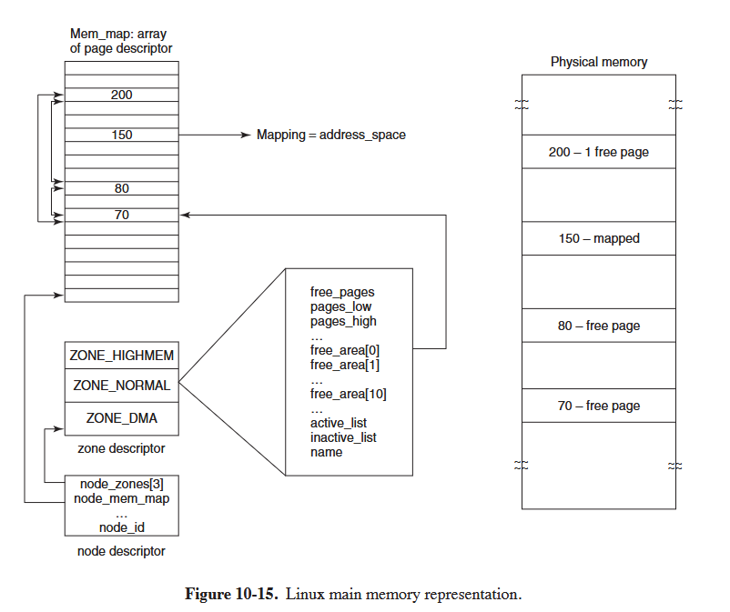

Linux maintains an array of page descriptors, of type page, one for each frame in the system. It calls it mem_map. Each page descriptor contains a ptr to the address space that it belongs to, and in the case the page is not free, a pair of ptrs which allow it to form doubly linked lists with other descriptors. This allows keeping together all free page frames.

Since physical memory is divided into zones, each zone maintains a zone descriptor, which contains info about the memory util within each zone, such as num of active or inactive pages, etc.

A zone descriptor also contains an array of free areas. 

Linux supports dynamically loaded modules, most commonly device drivers. Each one must be allocated a contiguous piece of kernel memory. 

### Memory-Allocation Mechanisms
There are several mechanisms for memory allocation. The main one for allocating new page frames of physical memory is the page allocator, which operates using the buddy algorithm:
- Initially memory consists of a single contiguous piece.
- When a request for memory comes in, it is first rounded up to a power of 2 (8 pages, for ex)
- The full memory chunk is then divided in half
- Since each of these pieces is still too large, the lower piece is divided in half again, and again.
- When we have a chunk of the correct size, it's allocated to the caller.

That leads to considerable internal fragmentation because if you want a 65-page chunk, you have to ask for and get a 128-page chunk.

So, Linuxhas a second memory allocation, the slack allocator, which takes chunks using the buddge algorithm but then carves slabs (smaller units) from them and manages the smaller units separately.

Since the kernel frequently creates and destroys objects of certain type (task_struct), it relies on object caches. These consist of ptrs to one or more slab which can store a number of objects of the same type.

A third memory allocator, vmalloc, is also available and is used when the requested memory needs to be contiguous only in virtual space, not in physical memory. 
In practice, this is true for most of the requested memory. But it results in performance degradation, so only used for large amount of contiguous virtual address requests.

### Virtual Address-Space Representation
Virtual addr space is divided into homogeneous, contiguous, page-aligned areas or regions. There can be holes in the address space between areas. Referencing these areas creates a fatal page fault. 

The page size is fixed: 4KB for Pentium, 8KB for the Alpha. On recent arhitectures, linux can support massive pages of 2 MB or 1 GB each.

vm_area_struct: describes a region of the address space. All these structs for a process are linked together in a list. These structs describe protection modes, and which direction it grows in. It also records whether the area is private to the process or shared.

### Paging
Linux, like other modern UNIX versions, no loner moves entire processes in and out of memory. Instead, it moves pages. And all memory management components is done on a page-granularity.

Main concept: MMU knows about some area of secondary memory (HDD/SSD) that is used as "vram". This VRAM space is used to store paged-out pages from the main memory when the system is running low on memory. This is called swapping. 

A process need not be entirely in memory in order to run. All that is actually required is the user structure and the page tables. If these are swapped in, the process is deemed "in memory", and can be scheduled to run. The pages of the text, data , and stack segments are brought in dynamically, one at a time, as they are requested. 

Paging is implemented partly by the kernel and partly by a new process called the page daemon (process 2). That daemon periodically looks around to see if there is any work to do. If the free memory is too low, it starts freeing up more pages. 

Linux is a fully demand-paged system with no pre-paging.

Pages are stored in paging partitions or swap files, with partitions being more efficient. Pages are only allocated in the swap area when required, and the system prioritizes paging partitions over files.

### Page Replacement Algorithm
Linux tries to keep some pages free so that they ca be claimed as needed. This pool must be continually replenished. PFRA (page frame reclaiming algorithm) is used to decide which pages to free.

There are 4 types of pages: unreclaimable (reserved or locked pages, kernel mode stacks), swappable (must be written back to the swap area or the paging disk partition before it can be reclaimed), syncable (must be written back to disk if they have been marked as dirty), and discardable.

kswapd is the process that initiates the page-replacement algorithm. During each run, only a certain target number of pages is reclaimed, typically around 32, this controls I/O loads, and can be configured.

It first tries to reclaim easy pages, then goes for the harder ones. 

## I/O In Linux
All I/O devices are made to look like files and are accessed as such with the same read and write system calls that are used to access all ordinary files. In some cases, device parameters must be set, and this is done using a special system call. 

### Fundamentals
Special files are used to integrate I/O devices into the file system. Each I/O device is assigned a path name, usually in /dev. A disk might be /dev/hdl. These can be accessed the same way as any other file. No special commands or system calls are needed. For example, `cp file /dev/lp` copies the file to the printer, causing it to be printed. 

2 types of special files:
- Block: block special file consists of a sequence of numbered blocks. Each block can be individually addressed and accessed (a program can open and read block 124 without first having to read blocks 0 to 123.) Usually, block special files are used for disks
- Character: Character special files are used for devices and input or output a character stream: keyboards, printers, networks, mice...

Each special file is associated with a device driver that handles the corresponding device. Each driver is identified by a major device number. 

### Networking
Sockets: analogous to mailboxes and telephone wall sockets in the real world. Used to interface to the network.
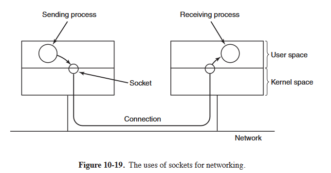
Sockets can be created and destroyed dynamically. Creating a socket returns a file descriptor, which is needed for establishing a connection, reading data, writing data, and releasing the connection. There's 3 common types of networking sockets support:
- Reliable connection-oriented by stream (pipe of streaming bits)
- Reliable connection-oriented packet stream (TCP)
- Unreliable pakcet transmission (UDP)

Before a socket can be used for networking, it must have an address bound to it (IPv4 or IPv6). Once sockets have been created on both the source and destination computers, a connection can be establised between them. Once party makes a listen system call on a local socket, which creates a buffer and blocks until data arrives. The other makes a connect system call, giving as parameters the file descriptor for a local socket and the address of a remote socket.

### I/O System Calls
Though most I/O can be done by just using the proper file, sometimes there's a need for something that is device specific. This is implementation dependent in terms of how Linux does it, but there's 1 or many system calls that can be used to manipulate certain configurations to the devices.

### I/O Implementation
I/O is implemented by a collection of device drivers, one per device type. The function of the drivers is to isolate the rest of the system from the quirks of the hardware. By providing standard interfaces between the drivers and the rest of the OS, most of the I/O system can be put into the machine-independent part of the kernel. 

When the user accesses a special file, the file system determines the major and minor device numbers belonging to it and whether it is a block special file of a character special file. The major number is used to index into one of 2 internal hash tables containing data structures for character or block devices. These contain pointers to the procedures to call to open the device, read it, write to it, and so on. 

Adding a new device type to Linux means adding a new entry to one of these tables and supplying th ecorresponding procedures to handle the various operations on the device. 

Each driver is split into 2 parts, both of which are part of the kernel and both of which run in kernel mode. The top half runs in the context of the caller and interfaces to the rest of Linux. The bottom half runs in kernel context and interacts with the device. Drivers are allowed to make calls to kernel procedures for memory allocation, timer management ... 

The I/O system is split into 2 major components: the handling of block special files and the handling of character special files.

I/O on block special files (disks): goal is to minimize the number of transfer that must be done. Linux has a cache between the disk drivers and the file system. A generic block layer holds these components together, performs the necessary translations between disk sectors, blocks, buffers, and pages of data, and enables the operations on them.

The cache is a table is a table in the kernel for holding thousands of the most recently used blocks. A check is made there first, preventing a potential expensive disk access.

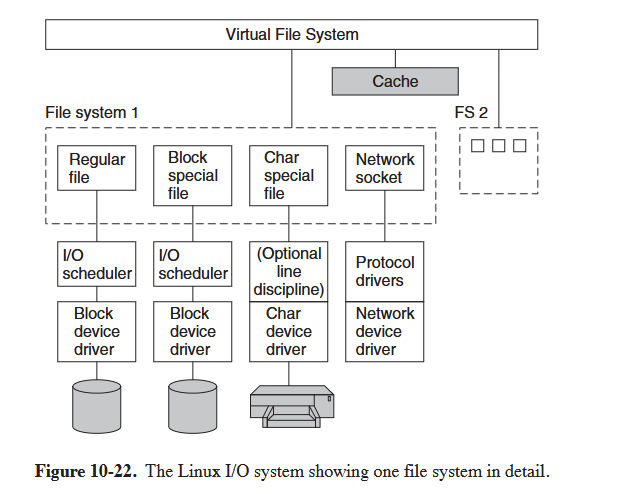

The page cache works for writes as well as for reads. When a program writes a block, it goes to the cache, not the disk. A prdflush daemon will flush the block to disk in the event the cache grows above a specified size. All dirty blocks are also written to the disk every 30 seconds. 

Linux relies on an I/O scheduler to reduce latency of disk-head movements. It reorders or bundles read/write requests to block devices. Disk operations are sorted in a doubly linked list, ordered by the addr of the sector of the disk request. New requests are inserted in this list in a sorted manner. It's then merged with adjacent requests to minimize disk head movement.

The interaction with character devices is pretty simple. There isn't really a need for random access. But line disciplines is an exeption. When enabled, local line editing can be done. 

The interaction with network devices is different. While network devices also produce/consume streams of characters, their asynch nature makes them less suitable for easy integration with existing interfaces. The networking device driver produces packets consisting of multiple bytes of data, along with netowrk headers. These packets are then routed thorugh a series of network protocol driers, and ultimately are passed to the user-space application. skbuff is the socket buffer structure, and it's used to represent portions of memory filled with packet data.

### Modules in Linux
Loadable modules are introduced to make it easier for Linux users to add new device drivers to the system. They can be loaded and unloaded dynamically. They can be anything from character or block device drivers, to entire file systems, network protocols, performance monitoring tools, etc.

When a module is loaded, several things have to happen:
- The module has to be relocated on the fly
- The system has to check to see if the resources the driver needs are available
- Any interrupt vectors that are needed must be set up
- The appropriate driver switch table has to be updated to handle the new major device type.
- Finally: The driver is allowed to run to perform any device-specific initialization


## The Linux File System
### Fundamentals
The ext2 file system is the main file system used by Linux. However, it supports several dozen file systems using the Virtual File System (VFS) layer. 

A Linux file is a sequence of 0 or more bytes containing artbitrary information. No distinction is made between ASCII files, binary files, or any other kind of file. File names are limited to 255 characters, and all the ASCII characters except NUL are allowed in file names. 

By convention, many programs expect file names to consist of a base name and an extension, that's fine, but these conventions are not enforced by the system. 

Directories are also stored as files and to a large extent can be treated like files. Here are the most common root directories:
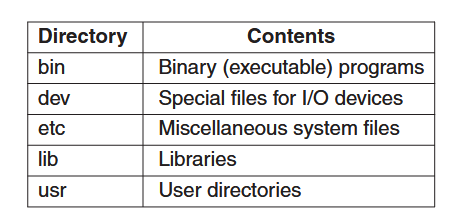

There are 2 ways to specify file namee: absolute path, relative path (to the current working directory).

Links: alot of the time, a user needs to refer to a file that belongs to another user. If 2 users are sharing a file, it will be located in a directory belonging to one of them, so the other would have to use an absolute path name to refer to it. So users can make a new directory entry that points to an existing file. This is called a link.

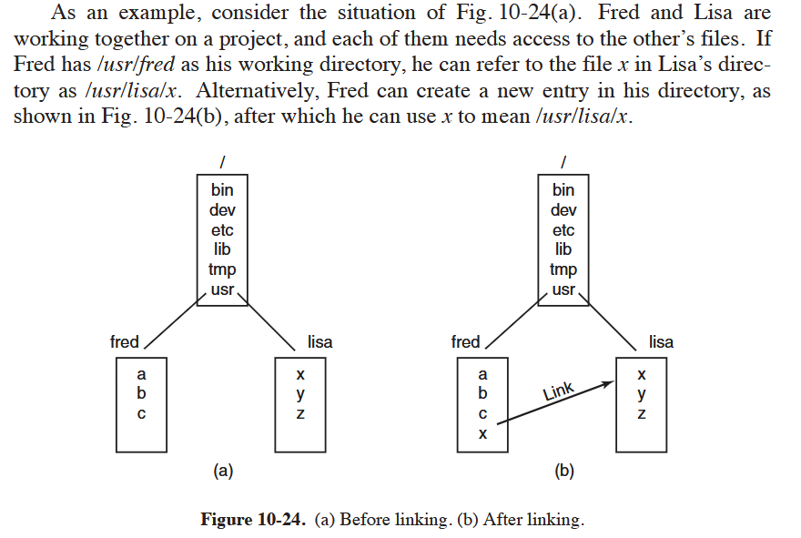

In addition to regular files, Linux also supports character special files and block special files. As mentioned earlier, these are used to interface to devices. Opening and reading from /dev/tty reads from the keyboard. 

How to handle multiple disks:
- One solution is to put a self-contained file system on each one and just keep them separate. With this solution, the user has to specify both the device and the file when anything other than the default is needed. This is the approach taken by a number of systems, including Windows 8.
- Linux instead allows one disk to be mounted in another disk's file tree. So, we could mount another device on the directory /b, and the user now sees a single file tree, and no longer has to be aware of which file resides on which device. 
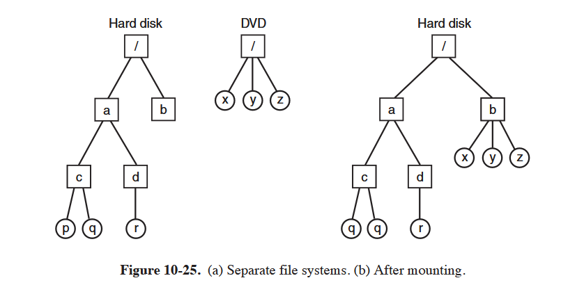

Locking: In some applications, 2 or more processes may be using the same file at the same time, which may lead to race conditions. One solution is to program the application with critical regions. This is inconvenient if the processes don't even know about each other. So, processes can lock as little as a single byte and as much as an entire file in one operation. The locking mechanism requires the caller to specify the file to be locked, the starting byte, and the number of bytes. If the operation succeeds, the system makes a table entry noting tha the bytes are locked. 

There's 2 kinds of locks: shared locks and exclusive locks. If a portion of a file already contains a shared lock, a second attempt to place a shared lock on it is allowed, but an attempt to put an exclusive lock on it will fail. 

### File-System Calls in Linux
Many system calls relate to files and the file system. Let's look at the sys calls that operate on individual files:
- `creat` call can be used to create a new file, and the protection bits are specified. The creat call also opens the file for writing. It returns a file descriptor. If it's done on an existing file, that file is truncated to length 0. 
- To read or write existing file, file must first be opened by calling `open` or `creat`. Afterward, the file can be closed by `close`. File descriptor can then be reused by a subsequent open call.

When a program starts executing in the standard way, file descriptors 0, 1, and 2 are already opened for stdin, stdout, and stderr.
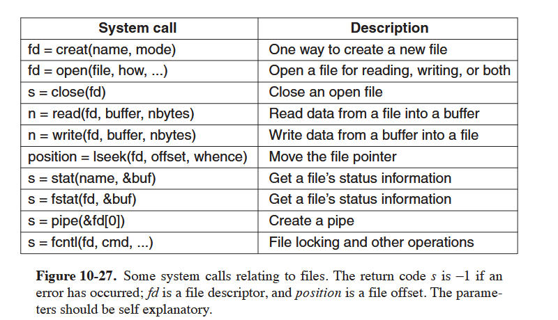

read and write are the most used file-related sys calls. They are simple, they have a file descriptor, a buffer, and the number of bytes to read or write. Though nearly all programs read and write files sequentially, some programs need to be able to access any part of a file at random. So each file has a ptr that indicates the current position in the file. This ptr is set to 0 when the file is opened, and is incremented by the number of bytes read or written.

For each file, Linux keeps track of the file mode (regular, dir, special file), size, time of last modification, and other information. Programs can ask to see this info via the `stat` system call. The first param is the file name, the second is a ptr to a structure where the info requested is to be put. Stat returns a bunch of fields related to the file. 

The `pipe` system call is sued to create shell pipelines. It creates a kind of pseudofile, which buffers the data between the pipeline components, and returns file descriptors for both reading and writing the buffer. 
Example: `sort <in | head -30`
fd 1 (stdout) in process running sort would be set by the shell to write to the pipe, and fd 0 (stdin) in the process running head would be set to read from the pipe.

This allows us to connect programs in arbitrary ways without having to modify them at all.

`fcntl` system call is used to lock and unlock files, apply shared or exclusive locks, and perform a few other file-specific operations. 

Let's look at some system calls that relate more to directories or the file system as a whole:
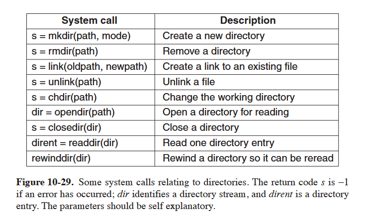

Linking to a file creates a new directory entry that points to an existing file.

Users can write to a directory. This is to maintain file system integrity, they can use sys calls to do that. 

### File System Implementation
Virtual File System Layer (VFS): hides from higher-level processes and applications the differences among many types of file systems supported by Linux, whether they are residing on local devices or are stored remotely. Devices and other special files are also accessed throught he VFS layer. 

ext2: Second extended file system (the first widespread linux file system). Modern default is ext4.

Linux systems can handle multiple disk partitions, each with a different file system on it.

### VFS
Used to enable applications to interact with different file systems. VFS defines a set of basic file-system abstractions and the operations which are allowed on these abstractions. Invocations of the system calls described previously access the VFS data structures, determine the exact file system where the accessed file belongs, and via function ptrs stored in the VFS data structures invoke the corresponding operation in the specified file system. 

There's 4 main file-system structures supported by VFS:
- Superblock: contains criticial info about the layout of the system
- i-nodes: each describe exactly one file (and dirs since they're files)
- Dentry: directory entry, single component of a path
- File: represents an open file

Dentries are just used to make is easier to facilitate dir operations and traversals of paths. They're stored in a cache called dentry_cache.

The file data structure is the in-memory reppresentation of an open file. And is created in response to the open system call. 

### Ext2 File System
This is mostly relevant to the new modern ext4, they're all based on the same fundamentals. 

Let's look at the disk partition layout:
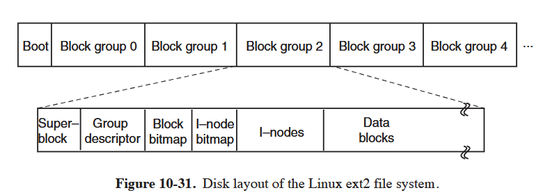

Block 0 is not used by Linux and ocntains boot code. Following it, the disk parittion is divided into groups of blocks, and each group is orgniazed as follows: superblock (contains info about layout of fs, num inodes, num disk blocks, start of the list of free disk blocks), then group descriptor(info about location so fht ebitmaps, num of free blocks and inodes in the group, num of dirs in the group).
2 bitmaps are used to keep track of the free blocks and free inodes. Then there's inodes, which describe exactly one file. They contain accounting info, as well as info to locate all the disk blocks that hold that file's data.
Then there's the actual data blocks, which is where all files and dirs are stored. If a file or directory consists of more than one block, the blocks don't need to be contiguous. 

I was wondering: why does a directory need to be stored in the data block if it's just one inode with pointers to file inodes? But that's because the list of file pointers isn't actually stored in the inode. That would be inefficient and require lots of inodes (since they have a fixed size) for larger directories. So the list of file pointers is stored in the data block.

