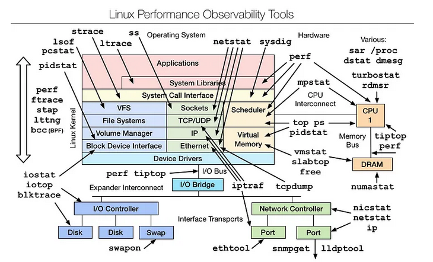

# Performance Analysis

## Case Study: Command Line Performance Investigation
[Source](https://netflixtechblog.com/linux-performance-analysis-in-60-000-milliseconds-accc10403c55)

This is an optimized approach to troubleshooting a server using basic Linux commands. Use the following commands:
- `uptime`: shows load / demand averages (# processes wanting to run), very high level overview, no details. It shows 3 averages: 1, 5, and 15min load averages. This allows you to check if the issue is currently affecting the system, or if it was previously affecting loads but is no longer present.
- `dmesg | tail`: Shows the last 10 system messages from the kernel ring buffer, if there are any. Look for errors that can cause performance issues.
- `vmstat 1`: Short for virtual memory stat, it prints a summary of key server statistics. Arg 1 is because we want a new summary every 1 second. Look out for:
    - r: number of processes waiting for CPU. This provides a better signal than load averages for determining CPU saturation, as it does not include I/O. An R value greater than system's CPU count is saturation.
    - free: Free memory in KB.
    - si, so: Swap-ins and swap-outs. If these are > 0, you are out of memory.
    - us, sy, id, wa, st: Breakdowns of CPU time, on average across all CPUs. us is user time, sy is system time, id is idle time, wa is wait time, and st is stolen time. The CPU time breakdown confirms if the CPUs are busy. A constant degree of wait I/O points to a disk bottleneck. 
- `mpstat -P ALL 1`: (multiprocessor statistics) Shows CPU time breakdowns per CPU core, which can be used to check for imbalances. A single hot CPU can be evidence of a single-threaded application.
- `pidstat 1`: Similar to top, but prints a rolling summary instead of clearing the screen. Can be useful for identifying patterns over time.
- `iostat -xz 1`: Shows Disk stats. Look for:
    - r/s, w/s, rkB/s, wkB/s: These are the delivered reads, writes, read Kbytes, and write Kbytes per second to the device. A performance problem might simply be due to an excessive load applied.
    - await: avg time for the I/O in ms. This is the time the application suffers, as it includes both time queued and time being serviced. Could point to saturation or device problems.
    - avgqu-sz: avg number of requests issued to the device. Values greater than 1 can point to saturation.
    - %util: device utilization. >60% typically leads to poor performance, and 100% means the device is saturated.
- `free -m`: Shows memory stats. Look for:
    - buffers: For the buffer cache, used for block device I/O.
    - cached: for the page cache, used by file systems.
    We just want to make sure these aren't near 0, which would lead to higher disk I/O and worse performance. Linux uses free memory for the caches, but can reclaim it quickly if applications need it. 
- `sar -n DEV 1`: Shows network stats. Look for:
    - rxkB/s and txkB/s: measure of workload, and check whether any limit has been reached.
- `sar -n TCP,ETCP 1`: Summarized view of some key TCP metrics, including:
    - active/s: number of locally-initiated TCP connections per second
    - passive/s: number of remotely-initiated TCP connections per second
    - retrans/s: number of TCP retransmits per second
    Active and passive counts are often useful as a rough measure of server load: number of new accepted connections, and number of downstream connections. Retransmits are a sign of a network or server issue, it may be an unreliable network, or it may just be an overloaded server dropping packets. 
- `top`: Shows top processes by CPU usage, and many other metrics we previously mentionned. But it refreshes, so harder to find patterns.

Summary:
- Check CPU util: are we saturated? Is the kernel/user space hogging CPU resources?
- Check memory: are we out of memory? Are we excessively swapping? 
- Check disk: are we busy? Are we waiting on I/O?
- Check network: are we sending/receiving a lot of data? Are we dropping packets?

## More on Linux Performance Tools and Methodologies
[https://netflixtechblog.com/netflix-at-velocity-2015-linux-performance-tools-51964ddb81cf](Source)

### Problem Statement Method
- What makes you think there is a perf problem?
- Has this system ever performed well?
- What has changed recently? Software? Hardware? Load?
- Can the perf degradation be expressed in terms of latency or run time?
- Does the problem affect other people or apps, or is it just you?
- What is the environment? (OS, kernel, hardware, etc.)

### Workload Characterization Method
- Who is casuing the load? (PID, UID, IP addr)
- Why is the load called? (Code path, stack trace)
- What is the load? (IOPS, tput, type, r/w)
- How is the load changing over time? 

# The USE Method
- For every resource, check:
    - Utilization: Is the resource busy?
    - Saturation: Is the queue of work for the resource growing?
    - Errors: Is the resource returning errors?

