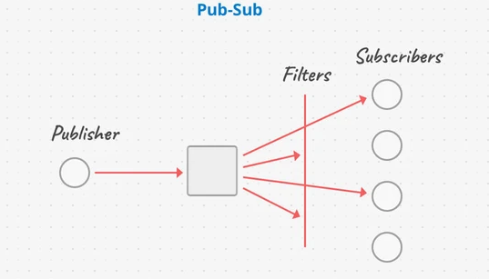

# Systems Design Basics
## Web Servers and Load Balancing
NGINX: open-source web server software used for reversee proxy, load balancing, and caching. It's event-driven, asynchronous, and uses master-slave architecture.

NGINX as a web server:
- serves static content

NGINX as a reverse proxy:
- forwards client requests to the appropriate backend server (or local application)

Most of the time, NGINX is used as a layer 7 (Application layer) load balancer:
- Receives requests directly from clients, and forwards them to the appropriate backend server
- It can also cache resources, and serve them directly to clients
- It can also terminate SSL/TLS connections, and forward unencrypted requests to the backend server (allowing for faster interal communication and processing times). Sometimes it's worth it and practical (in very secure environments), but usually you'd want to have SSL/TLS end-to-end.

Let's not forget there's also Apache, which came first. It's a bit more feature-rich, but it's not as fast as NGINX. It's also more resource-intensive.

BTW, you can also use layer 4 load balancers, which direct traffic based on IP address and port number and don't need to consider the actual content of the request.

#### Static vs Dynamic Content Delivery
Static Content: content that doesn't change often, like images, CSS, and JavaScript files. It's served directly to the client by the web server (or in most cases, cached and sent by the CDN).

Dynamic Content: content that changes often, like user-generated content, or content that needs to be generated on-the-fly. It's generated by the application server, and then served to the client.

## CDNs
Content Delivery Network: Service that accelerates internet content delivery.

Scenario: we have users all over the world, but our servers are not as distributed. 

We want to physically reduce the distance between the user and server delivering the content. So we place content delivery endpoints in as many locations as possible, these cache whatever content we would originally serve from the server. And the users can query the CDNs directly, drastically reducing round trip delays, and reducing the load on the main server.

These are used for data-heavy aplication. A CDN can delivers both static and dynamic content. Static content is cached, while dynamic content requires CDNs to reconnect with the origin server for each request. But they accelerate the delivery process by optimizing the connection between themselves and the origin servers, as oppposed to the user connecting directly to the origin server. When going through CDNs, you don't need to establish a new connection for each request, that's already assumed to be completed and ready for transmissions. You can also take advantage of your Edge CDN servers to validate user requests.

## In-memory Caches
Redis: in-memory data store (key-val). Traditionally used as a caching layer serverside, data stored in RAM (fast). Stores frequently sent requests to reduce DB loads. 

## Browser Caches
On-device storing of static web content. Browsers store these files until their time to live (TTL) expires or until the hard drive cache is full. 

## Distributed Systems
A collection of computer programs that utilize computational resources across multiple separate nodes to achieve a common, shared goal.

They aim to achieve:
- Scalability (ability to handle increased load)
- Fault Tolerance (ability to handle failures)
- Concurrency (Components operate simultaneously and independently)
- No Single Point of Failure (if one component fails, the system can still operate)

CAP Theorem:
- Consistency: all nodes see the same data simultaneously
- Availability: Every request receives a response, even if some nodes are down
- Partition Tolerance: The system continues to operate despite network partitions

Data Replication:
- Data is copied across multiple nodes to improve reliability and performance
- There's multiple replication techniques:
    - Leader-Follower replication: One node handles writes, other nodes replicate data
    - Multi-Leader replication: Multiple leaders handle writes: conflict resolution is needed
    - Eventual Consistency: Data becomes consistent over time

Sharding:
- We divide data across multiple nodes based on a shard key (user ID, for ex)
- Horizontal Scaling: each node stores a subset of data

Distributed Locks:
- Sometimes, nodes need exclusive access to a resource that is shared across a range of servers
- Distributed locks can be used to ensure exclusive access across the horizontal servers (can use Redis or Zookeeper for this)
- A node would set a resource's value to "locked" while it's in use, then later it unlocks it

Consistency:
- Most of the time, data can be "eventually consistent", meaning there can be a period of time where some data is stale
- Banking systems and such need strong consistency, which means you have to keep this in mind when caching stuff that other processes access

Specialized Searches and Indexing:
- Many database services allow multiple indexes for each object, ElasticSearch is usually used. 

There's both local and global caching with distributed systems:
- Local: Redis, on a single node
- Global: CDNs like Cloudflare that service multiple nodes

There's also distributed server caches (memcached, for example):
- Stores key-value pairs in memory and scales horizontally across multiple nodes
- No replication (for memcached)
- Consistent hashing: keys are distributed across nodes
- Basically, if the web server gets a cache miss for some resource a client requests, if gets it from the db, then it stores the db query result in their OWN memcached, memcached assigns the key to ONE node based on some modulo hashing value. This allows for client-side hashing, where the client's hash determines which node holds the data they want in their cache. So technically, not all nodes have the same cache here. Each node has their own cache with their own cached data, but the client can know which node to query to ensure they have their data already cached.

Distributed System Architectures:
- Client-Server: Clients request resources from a central server
- Peer-to-Peer: Nodes are both clients and servers, sharing resources directly
- Master-Slave: A master node manages one or more slave nodes
- Microservices: Application is divided into small, independently deployable services
- Even-Driven: Components communicate by emitting and consuming events

Communication Protocols:
- ***REST***: stateless, request-response, simple. Easy to scale horizontally with load balancer.
- ***Long Polling***: client makes a request to the server, server holds the request open until it has new data to send the client. Allows the use of load balancing, and easy firewall config (just like REST). But it allows clients to get real-time server updates without having to request it themselves (like REST).
- ***Websockets***: necessary if you need realtime, bidirectional communication between client and server. They can be challenging to add to design of architecture since you need to maintain the connection between client and server. This is a challenge when using load balancers, and it can be hard for a server to maintain many open connections. So, use message broker to handle the communication between the client and the server. This ensures you don't need to maintain long connections to every backend service. So: client -> load balancer -> websocker servers -> message broker -> backend services
- There's also ***Server Sent Events (SSE)***, basically same as websockets but 1-way server->client communication. Connection remains open, and usually integrates easily to HTTP infra with load balancers and firewalls and such.

Message Queues:
- Producers of messages put messages in a queue, and consumers fetch from that queue whenever they can

Pub-Sub:
- Messaging-oriented middlewarethat pushes a producer's newly published message based on a subscription of the consumer's preferences

Best Practices:
- Assume nodes will fail, use retries, replication, and fallbacks
- Ensure repeated operations don't cause unintended side effects
- Use tools like Promehteus and Grafana for observability
- Simulate failures to ensure resilience in production

# Building Scalable Systems
Here is a list of technologies and methodologies that major companies use to build scalable systems:
- When there might be complex relationships between data, use a graph database. It closely mimics the organic relationships that form in common social media platforms.
- Automate as much as possible. 
- Application nodes should be stateless to simplify consistency and load balancing.
- Object storage (S3) should be used for images and other static files.
- Large tasks should be queued, with workers processing them asynchronously to avoid app response bottlenecks.
- For notification purposes, web sockets should be used. They allow for bi-directional communication between the server and client. However, web sockets tend to be stateful, so they should be used sparingly.
- Sharding: Splitting data across multiple databases to improve performance and scalability. For example, a user database can be split into 2, where one database stores users with even IDs and the other stores users with odd IDs.
- The publish-subscribe communication model is often used because of its scalability. If a company wants to develop a new feature that depends on the existing data stream, they can just subscribe to the data stream and process the data as needed. The data stream is not affected/unaware of the new feature.

# How would I design Spotify?
1. Identify key features: Songs, playlists, users, artists, podcasts
2. Define problem scope: Ask what should be the focus? For this example: Finding and playing music
3. Define use cases: browse music, search for song, play song
4. Think about metrics: How many users? A billion. How many songs? 100 million. File size: assume about 5 MB per song. So around 500TB of total song data. With 3x replication, Around 1.5PB. Metadata: 100B per song ish, so 10GB total, not a factor.
5. High level overview: Client application, Load balancer, replicated web servers, Database
6. Outline the DB schemas: How many DBs? One for metadata (users, songs, artists...), One for song audio. Why split this into 2? We have static content: the song files. So use S3 for that. For metadata, use a relational DB. Schema for RDS: song_id, song_url, artist, genre, link to album cover, audio_link
7. Drill down on use cases: 
    - User searches for a song: goes through LB, to web server, to metadata DB, which returns a list of songs that match the query. That's pretty efficient. 
    - User playes a song: goes through LB, to web server, to metadata DB, which returns song URL. Then web server has to fetch the song from S3 and stream it to the user. To stream, you need a web socket connection which allows constant communication between server and client. That might not be necessary: Just wait for the client to have entire song in memory before starting to play it. That eliminates possible lags.
8. Think about bottlenecks:
    - Inefficient streaming for songs with high volume of requests: can easily overload song bucket. Takes alot of bandwidth for the web servers as well. Solution: CDNs as song audio caches. Relieves load on S3 and web servers.
    - Caching metadata: Use Redis to cache metadata. Relieves load on the RDS DB and ensures that popular requests are efficiently served.
    - Think about cache on the server level: Maybe a distributed cache, like Memcached, to cache song URLs and relieve load on the DBs. Maybe load entire songs on the web servers to avoid streaming from S3. (Multi-layer caching)

# Design a botnet that can exploit 10000 low-end machines to run code. All machines need to crawl web pages and return results. No machine should crawl a page twice.

# Design a system that stores and retrieves images for Facebook

# How would you design a cache API?

# How would you design a system that manipulates content sent from a client? (clean offensive words for ex)

# Design YouTube